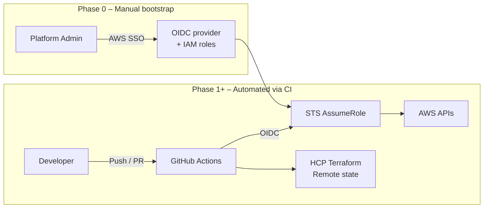

# AWS Cloud Platform IaaC

This repository contains the Infrastructure as Code (IaC) setup for an AWS cloud platform using **Terraform** and **GitHub Actions**, authenticated via **AWS OpenID Connect (OIDC)**.

The architecture follows a deliberate and realistic lifecycle that reflects real-world AWS security and trust constraints.  
In particular, **day-zero bootstrap is manual by design and intentionally kept outside CI/CD**.

---

## Design principles

- No long-lived AWS credentials stored in CI/CD  
- GitHub Actions authenticate to AWS using OIDC  
- Clear separation between manual bootstrap and automated provisioning  
- Reusable Terraform modules  
- Strict environment and region isolation  
- Predictable, low-risk infrastructure lifecycle  

---

## Repository structure

```
aws-cloud-platform-iac-github-actions
├── README.md
├── modules
│   ├── finops
│   │   └── budget-guardrails
│   └── iam
│       └── github-oidc-role
└── states
    ├── dev
    │   ├── bootstrap
    │   ├── base
    │   └── eu-central-1
    └── prod
        ├── bootstrap
        ├── base
        └── eu-central-1
```

- **modules/** contains reusable Terraform modules  
- **states/** contains environment- and region-specific Terraform configurations  

---

## Lifecycle overview

The platform is built and operated in clearly separated phases.  
Each phase exists for a specific reason and has different security and execution characteristics.

---

## Platform architecture



**What this diagram shows**

- Trust is established **manually first**
- GitHub Actions only consumes pre-created IAM roles
- Terraform runs inside GitHub Actions
- HCP Terraform is used exclusively for state and locking
- AWS is modified only via short-lived, scoped credentials

---

## Phase 0 — Manual bootstrap (one-time, outside GitHub Actions)

This repository assumes that an **initial manual bootstrap has already been completed**.

This step cannot be automated on day zero because:

- No Terraform backend exists yet  
- No trust relationship exists between GitHub and AWS  
- GitHub Actions cannot assume an IAM role that does not yet exist  

The following resources are created **manually, once per AWS account**:

- S3 bucket for Terraform remote state  
- DynamoDB table for Terraform state locking  
- IAM OIDC provider for GitHub Actions  
- Initial IAM role(s) that GitHub Actions will later assume  

This step is intentionally executed **outside GitHub Actions**, using AWS SSO or other elevated credentials, and is **not part of the automated workflows** in this repository.

---

## Phase 1 — Environment bootstrap (`states/*/bootstrap`)

**Purpose**
- Establish environment-level foundations  
- Prepare the account for safe automation  

**Typical contents**
- IAM policies  
- Guardrails  
- Account- or organization-level configuration  

**Execution characteristics**
- Per environment (dev, prod, etc.)  
- Usually applied manually or with elevated permissions  
- Very low change frequency  

---

## Phase 2 — Base infrastructure (`states/*/base`)

**Purpose**
- Shared infrastructure used across all regions  
- Stable, low-churn components  

**Typical contents**
- AWS Budgets and FinOps controls  
- Shared IAM roles  
- Monitoring foundations  

**Execution characteristics**
- Automated via GitHub Actions  
- Uses OIDC-assumed IAM roles  
- Safe once backend and trust are in place  

---

## Phase 3 — Regional infrastructure (`states/*/<region>`)

**Purpose**
- Region-scoped and workload-specific infrastructure  

**Typical contents**
- Regional AWS services  
- Environment-specific resources  

**Execution characteristics**
- Fully automated  
- CI/CD driven  
- Uses GitHub Actions with OIDC authentication  

---

## Terraform modules

### `iam/github-oidc-role`

Creates IAM roles that can be assumed by GitHub Actions using OpenID Connect.

**Benefits**
- No stored AWS secrets  
- Short-lived credentials  
- AWS-native authentication model  
- Clear trust boundaries  

---

### `finops/budget-guardrails`

Encapsulates AWS Budgets and cost-control logic.

**Benefits**
- Reusable across environments  
- Centralized FinOps configuration  
- Clear separation of policy and usage  

The module automatically targets the AWS account it is applied to, making it safe across multiple environments and accounts.

---

## Summary

This repository intentionally separates **trust establishment** from **automation**.

Manual bootstrap is a one-time prerequisite that enables:

- Secure GitHub Actions authentication  
- Safe and repeatable Terraform automation  
- Clear operational and security boundaries  

Once bootstrap is complete, all base and regional infrastructure can be managed fully through GitHub Actions using short-lived, auditable credentials.

This mirrors how mature platform teams design and operate AWS environments in practice.
