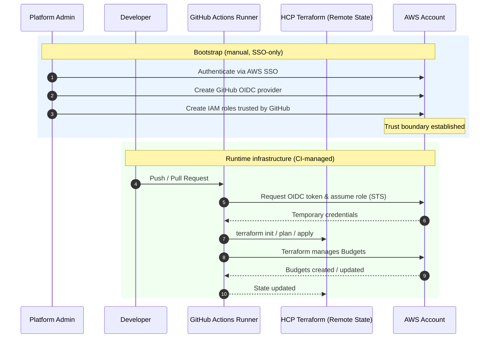

# AWS Cloud Platform IaC (Terraform + GitHub Actions + OIDC)

This repository demonstrates a **modern, secure AWS platform setup** using:

- **Terraform** with an **HCP Terraform (Terraform Cloud) remote backend**
- **GitHub Actions** for CI/CD
- **AWS OIDC authentication (no static AWS credentials)**
- **Clear separation between bootstrap and runtime infrastructure**
- **FinOps guardrails using AWS Budgets and alerts**

The design mirrors how real platform teams operate: **identity and trust are established once**, while day-to-day infrastructure changes flow safely through CI.

---

## Architecture Overview

### High-level execution flow (Bootstrap + Runtime)



The diagram shows two distinct phases:

- **Bootstrap (day 0)**: Manual, SSO-authenticated setup of identity and trust  
- **Runtime (day 1+)**: Fully automated infrastructure changes via GitHub Actions  

This separation intentionally prevents CI from modifying its own trust boundaries.

---

## Repository Structure

```text
.
├── modules/
│   ├── finops-budget/        # Reusable AWS Budget module
│   └── github-oidc-role/     # Bootstrap-only: GitHub OIDC IAM role
│
├── states/
│   ├── dev/
│   │   ├── bootstrap/        # One-time SSO bootstrap (manual)
│   │   └── base/             # Runtime infrastructure (CI-managed)
│   └── prod/
│       ├── bootstrap
│       └── base
│
└── .github/
    └── workflows/
        └── terraform.yml
```

---

## Bootstrap vs Base (Key Concept)

### Bootstrap (manual, SSO-only)

**Purpose**
- Create the GitHub OIDC provider in AWS
- Create IAM roles trusted by GitHub Actions

**Why manual**
- GitHub Actions cannot create the IAM trust it later relies on
- Prevents circular trust and privilege escalation
- Establishes a protected identity boundary

**Characteristics**
- Executed manually using AWS SSO
- Rarely changed
- Never executed by CI

**Example**
```bash
aws sso login --profile admin
cd states/prod/bootstrap
terraform init
terraform apply
```

---

### Base (CI-managed, OIDC)

**Purpose**
- Create runtime infrastructure:
  - AWS Budgets
  - Email alerts
  - (Future: S3, IAM, data platform, etc.)

**Characteristics**
- Executed by GitHub Actions
- Authenticated via AWS OIDC (no access keys)
- Separate dev/prod environments
- Manual approval required for prod

---

## Authentication Model

### Why OIDC?
- Eliminates long-lived AWS credentials
- Uses short-lived, least-privilege access
- Strong auditability and reduced blast radius

### How it works
1. GitHub Actions requests an OIDC token
2. AWS verifies the token using the GitHub OIDC provider
3. AWS issues temporary STS credentials
4. Terraform uses those credentials to manage infrastructure

Each GitHub **environment** (`dev`, `prod`) defines:
- Its own `AWS_ROLE_TO_ASSUME`
- Its own approval rules

---

## Terraform State Strategy

- **HCP Terraform remote backend**
- **One workspace per environment**
  - `dev/base`
  - `prod/base`
- No cross-account or shared state

When environments move to a new AWS account:
- A new workspace is created
- Backend configuration is updated
- Terraform starts from a clean state

---

## FinOps Budget Module

The `finops-budget` module:
- Creates a monthly AWS Cost Budget
- Sends email alerts at:
  - 50%
  - 80%
  - 100%
- Automatically targets the **current AWS account**

```hcl
data "aws_caller_identity" "current" {}

account_id = data.aws_caller_identity.current.account_id
```

This makes the module:
- Account-agnostic
- Safe across multiple AWS accounts
- Compatible with both SSO and OIDC

---

## CI/CD Workflow Behavior

### Automatically runs
- `terraform fmt -check`
- `terraform validate`
- `terraform plan` (dev + prod)

### Automatically applies
- `dev/base` on merge to `main`

### Requires manual approval
- `prod/base` via GitHub Environments

---

## What Happens If Budgets Are Deleted Manually?

- If deleted in AWS:
  - Terraform will recreate them on the next apply
- If removed from Terraform state:
  - Terraform treats them as new resources
- If removed from code:
  - Terraform leaves them deleted

Terraform remains the source of truth.

---

## Design Principles

- Bootstrap once, carefully
- CI manages runtime infrastructure
- No static secrets
- Strong environment isolation
- Clear auditability

---

## Summary

This repository demonstrates a **production-grade Terraform platform** with:

- Secure OIDC-based authentication
- Clean separation of identity and infrastructure
- Real-world FinOps guardrails
- A scalable foundation for future expansion

This mirrors how modern platform teams design AWS environments at scale.